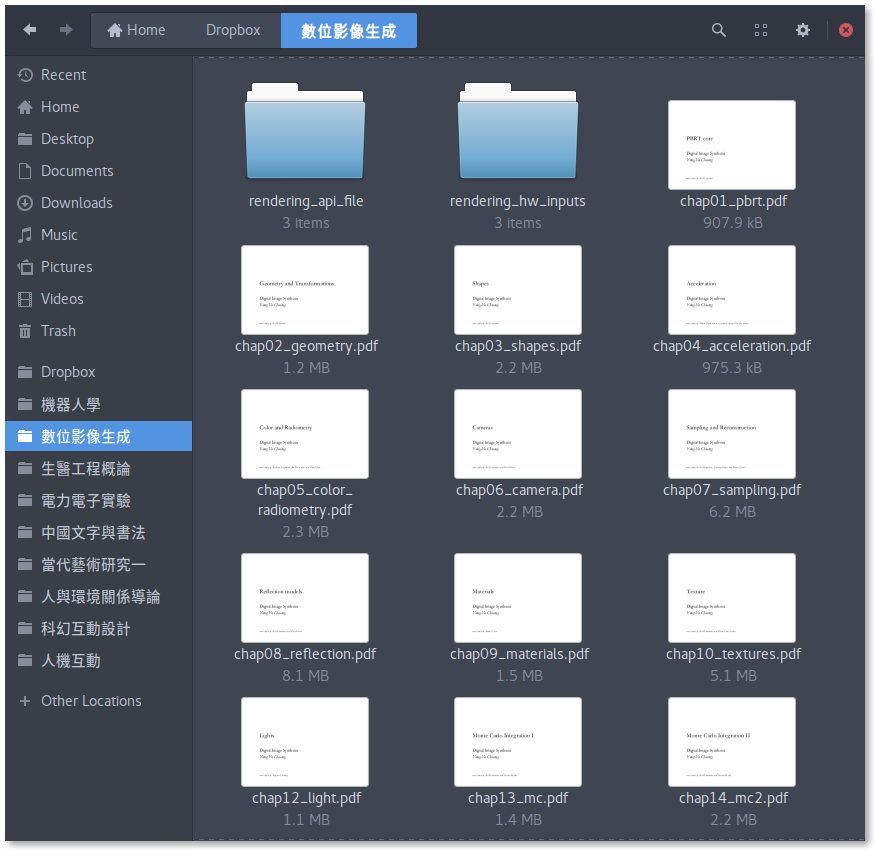

# GNU/Linux 繁體中文字型設定

我在 [Arch Linux](https://www.archlinux.org/) 作業系統上的字型設定.

## Font preferences

圖形介面的字型設定檔主要在 `fontconfig/fonts.conf` ， `fontconfig/conf.d/` 則放置其他設定。

[fonts.conf](fontconfig/fonts.conf) 中每種類型字型會有一個優先順序的清單，當第一順位的字型找不到對應的字時，就會去第二順位的字型找，以此類推。因此第一順位通常是英文字型，第二順位是中文字型。

以下字型皆為開放原始碼(Open Source)：

### Sans-serif (無襯線/黑體)

桌面介面主要字體：

1. **[Cantarell](https://github.com/GNOME/cantarell-fonts)**

  GNOME 預設字型。 

  Arch Linux Package: `cantarell-fonts`

2. **[Source Han Sans TC Medium (思源黑體)](https://github.com/adobe-fonts/source-han-sans)**

  由 Adobe 與 Google 開發的一套中文、日文、韓文(CJK)黑體字型，包含七種粗細(Weight)。
  
  TC 代表 Traditional Chinese ，選用中粗的 Medium 當作一般桌面介面的字型，搭配同樣較粗寬版的 Cantarell ，易於辨識。

  Arch Linux Package: `adobe-source-han-sans-tw-fonts`

### Serif (襯線/明體)

PDF、網頁中可能會出現：

1. **[Linux Libertine](http://www.linuxlibertine.org/)**

  Arch Linux Package: `ttf-linux-libertine`

2. **Source Han Sans TC Regular (思源黑體)**

  尚未找到優美適合的中文明體字型，先以較細的 Regular 思源黑體代替。

### Monospace (等寬)

終端機所使用：

1. **[Source Code Pro](https://github.com/adobe-fonts/source-code-pro)**

  同樣是 Adobe 開發的等寬字型，中性而優美，字母與數字易於辨認，適合長久閱讀，不易看錯。

  Arch Linux Package: `adobe-source-code-pro-fonts`

2. **Source Han Sans TC Medium (思源黑體)**

## 如何使用設定檔 

將資料夾 `fontconfig` 放至 `~/.config/`。

使用者的字型可用資料夾分類放到 `~/.fonts/`。

## 參考

- [Arch Linux Wiki: Fonts](https://wiki.archlinux.org/index.php/fonts): 可下載的字型目錄。
- [Arch Linux Wiki: Font configuration](https://wiki.archlinux.org/index.php/Font_configuration): 字型設定與疑難排解。

## 環境

- Operating System: Arch Linux
- Desktop Environment: GNOME
- GTK+ Theme: Arc Dark
- Icon Theme: Elementary 
